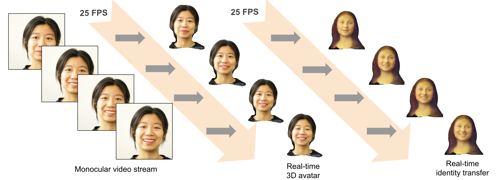
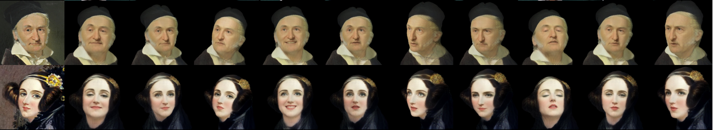

# LiveAvatar 


[](https://scorecard.dev/viewer/?uri=github.com/IntelLabs/LiveAvatar)
<!-- UNCOMMENT AS NEEDED
[](https://github.com/IntelLabs/ConvAssist/actions/workflows/run_unittests.yaml)
[](https://pytorch.org/get-started/locally/)

-->

## <p align="center">Live conversion of monocular video streams to 3D Gaussian head avatars</p>
<br>



 
## <p align="center"> Live cross-identity animation from a single image</p>

 

# Table of Contents

- [Installation](#installation)
- [Quick Start](#quick-start)
- [Streaming server](#running-the-streaming-server-webcam)
- [Training](#training)

[//]: # (- [Troubleshooting]&#40;#troubleshooting&#41;)


## Installation

Minimum tested requirements (older versions might still work):
- Python 3.12
- Cuda 12.6
- PyTorch 2.7
- Ubuntu 24.04

### Clone the project
```
git clone https://github.com/IntelLabs/LiveAvatar.git
cd LiveAvatar
```

### Install Python packages
```
pip install -r requirements.txt
```

### Install INRIA diff-gaussian-renderer

```bash
pip install git+https://github.com/graphdeco-inria/diff-gaussian-rasterization.git --no-build-isolation
```
See here for details:
https://github.com/graphdeco-inria/diff-gaussian-rasterization


### Install PyTorch3D
Follow the installation guide on https://pytorch3d.org.
```
git clone https://github.com/facebookresearch/pytorch3d.git
cd pytorch3d && pip install .
```

If you encounter problems during install, try:
```
pip install . --no-build-isolation
```


### Download LiveAvatar model weights

- ***We are preparing the release of the model file***


## Quick Start


### Run the demo

After installation, test with the provided demo:

```bash
# Basic demo with default images
python demo.py

# Specify custom images
python demo.py --target_image="path/to/target.jpg" --exp_image="path/to/expression.jpg"

# Use provided demo faces
python demo.py --target_image="assets/demo_faces/mona_lisa.jpg" --exp_image="assets/demo_faces/gothic_woman.png"
```

**Expected Output:**
- Window 1: Target face (identity source)
- Window 2: Expression source face
- Window 3: Animated 3D avatar (rotating point cloud)
 

## Running the Streaming Server (Webcam)

For real-time avatar generation with webcam:

```bash
# Use webcam input with GUI (default)
python streaming_server.py

# Use video file as input
python streaming_server.py --input video --video_file="path/to/video.mp4"

# Disable GUI (headless mode)
python streaming_server.py --no-gui
```

**Expected Output:**
- Window 1: `[Tracker] Input frame` - Your webcam feed with face detection
- Window 2: `LiveAvatar` - Real-time 3D avatar rendering

**Interactive Controls:**
- **Space** - Cycle through reference images (blend your face with Mona Lisa, Vincent van Gogh, etc.)
- **C** - Clear reference (use only your own face)
- **0-9** - Select different camera viewpoints
- **Arrow Keys** - Next/prev. reference image
- **Mouse drag** - Rotate camera 
- **+/-** - Adjust camera distance
- **Q** - Quit application

**Additional Options:**
```bash
# Stream over network socket
python streaming_server.py --input socket --host 127.0.0.1 --port_recv 9000

# Custom camera settings
python streaming_server.py --camera-azimuth 45.0 --camera-elevation 15.0

# Use specific reference image
python streaming_server.py --ref-img-id 0  # 0 = Mona Lisa, 1 = Vincent
```


## Training

### Install pre-processing libraries

#### Face segmentation: face-parsing.Pytorch 

```bash
git clone https://github.com/zllrunning/face-parsing.PyTorch.git libs/face_parsing_pytorch
```
Download the face-farsing.PyTorch [pre-trained model](https://drive.google.com/open?id=154JgKpzCPW82qINcVieuPH3fZ2e0P812) and save it in `./libs/face_parsing_pytorch/res/cp`

#### Background removal: RobustVideoMatting 
```bash
git clone https://github.com/PeterL1n/RobustVideoMatting.git libs/RobustVideoMatting
```
Download the RobustVideoMatting [pre-trained model](https://github.com/PeterL1n/RobustVideoMatting/releases/download/v1.0.0/rvm_resnet50.pth) and save it in `./libs/RobustVideoMatting`


### Training data setup

#### CelebV-HQ

Run face tracker to perform frame extraction, video matting, facial keypoint detection, and camera pose estimation on input videos in 'CelebV-HQ/35666':
```
python datasets/parallel_prepare_celebvhq.py --st 0 --None --show False --root ./data/datasets/CelebV-HQ --output_dir ./data/datasets/CelebV-HQ/processed_celebvhq
```

The directory *./CelebV-HQ* should have the following structure

```
CelebV-HQ/
- celebvhq_info.json
- 35666/
- processed_celebvhq/
    - frames/
    - alpha/
    - seg/
    - poses/
```

#### Option 1
Use config parameter 'celebvhq_root' to specify dataset location.

```
train.py --celebvhq_root=/mydata/CelebV-HQ
```


#### Option 2
Place training data in ./data/datasets or create symlink to pointing to training data location:
```
ln -s </foo/bar/data> ./data
```

with CelebV-HQ located in /foo/bar/data/datasets/CelebV-HQ.
